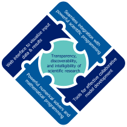

The |ixmp|
==========

   Key features of the |ixmp| :cite:`huppmann_messageix_2018`

The |ixmp| (ixmp) is a data warehouse for high-powered numerical scenario analysis.
It is designed to provide an effective framework for integrated and cross-cutting analysis (hence the abbreviation *ix*).

The platform allows an efficient workflow between original input data sources and implementations of mathematical models, via application programming interfaces (API) with the scientific programming languages Python and R.
The platform also includes an API with the mathematical programming software `GAMS <https://gams.com>`_.

For the scientific reference, see Huppmann et al. (2019) :cite:`huppmann_messageix_2018`.

.. figure:: _static/ix_components.png

   Components and their interlinkages in the |ixmp| (source :cite:`huppmann_messageix_2018`):
   web-based user interface, scientific programming interface,
   modeling platform, database backend,
   implementation of the |MESSAGEix| mathematical model formulation

Getting started
---------------

.. toctree::
   :caption: Getting started
   :hidden:
   :maxdepth: 2

   install
   tutorials
   cli

- :doc:`install`
- :doc:`tutorials`
- :doc:`cli`

Scientific programming API
--------------------------

.. toctree::
   :caption: Scientific programming API
   :hidden:
   :maxdepth: 2

   api
   api-r
   api-backend
   file-io
   api-model
   reporting
   data-model

The `ixmp` has application programming interfaces (API) for scientific workflows and data processing.

- :doc:`api`
- :doc:`api-r`
- :doc:`api-backend`
- :doc:`file-io`
- :doc:`api-model`
- :doc:`reporting`
- :doc:`data-model`

Help & reference
----------------

See the index page of the :doc:`MESSAGEix documentation <message_ix:index>` for a complete overview of different sources of help.

.. toctree::
   :caption: Help & reference
   :hidden:
   :maxdepth: 2

   whatsnew
   bibliography
   notice
   contributing
   contributor_license

- :doc:`whatsnew`
- :doc:`bibliography`

License & user guidelines
-------------------------

The |ixmp| is licensed under an `APACHE 2.0 open-source license`_.

.. _`APACHE 2.0 open-source license`: http://www.apache.org/licenses/LICENSE-2.0
.. _`LICENSE`: https://github.com/iiasa/ixmp/blob/master/LICENSE

Please see the :doc:`notice` for using the platform in scientific research.
:doc:`Contributions <contributing>` to the platform itself are also welcome; new contributors are asked to sign a :doc:`contributor_license`.
