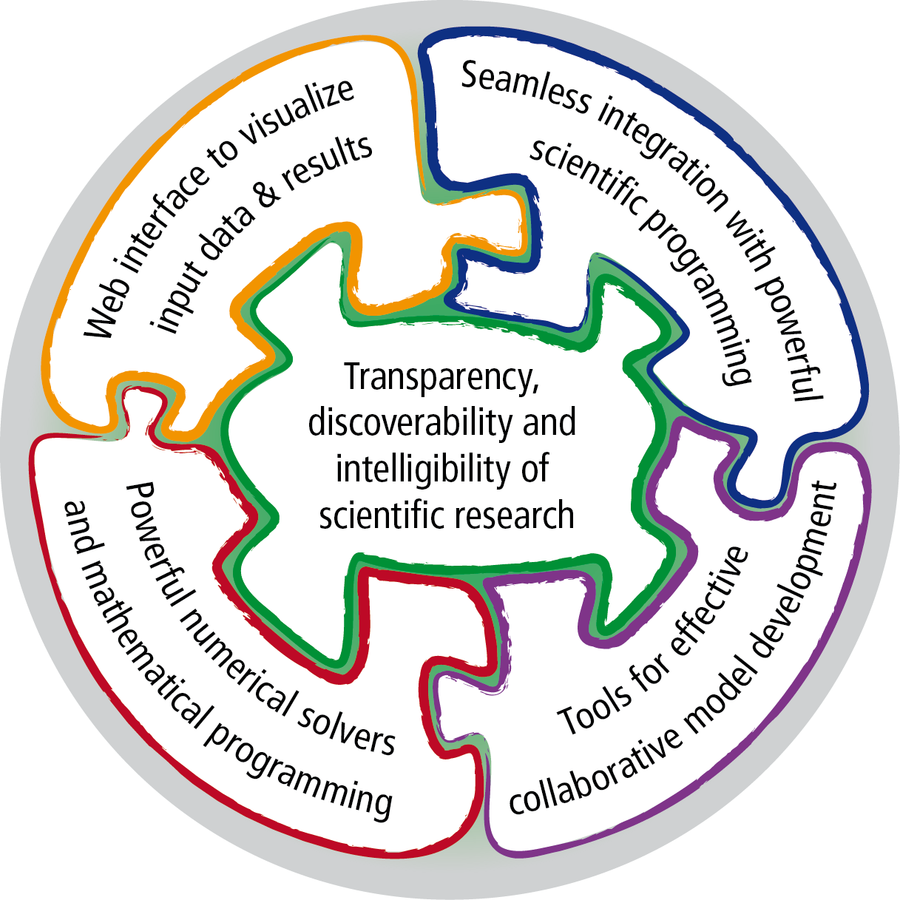
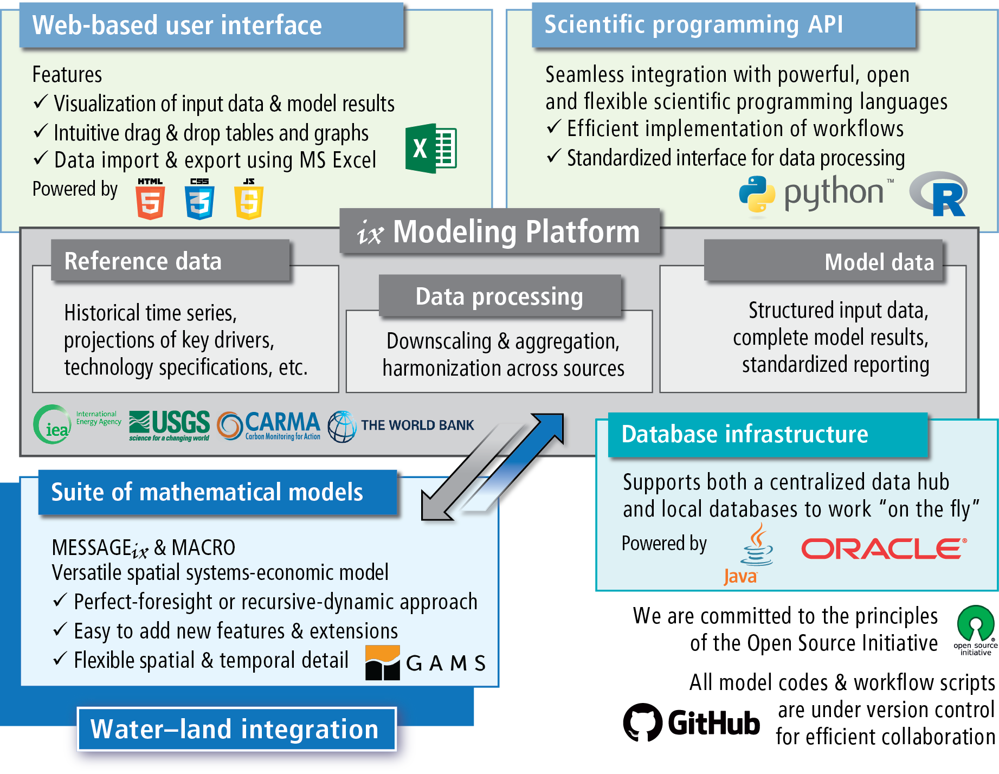

The |ixmp|
==========

   
   The components of the |ixmp|

The aim of the platform is to provide an effective framework 
for integrated modeling and cross-cutting analysis (hence the name |ixmp|).

The framework allows an efficient workflow between original input data sources
and the implementation of the mathematical model formulation, via both 
a web-based user interface and application programming interfaces (API)
with the scientific programming languages Python and R.
The platform also includes an API with the mathematical programming
software system `GAMS`_.

For the scientific reference, see Huppmann et al., 
in preparation :cite:`huppmann_messageix_2018`.

.. _`GAMS` : http://www.gams.com

An overview of the |ixmp|
-------------------------

   Component features and their interlinkages in the |ixmp|:
   
   - a web-based user interface,
   - scientific programming interfaces to Python and R ,
   - a platform core linked to a database instance,
   - integration with numerical models (e.g., the `MESSAGEix`_ Integrated Assessment model)

.. _`MESSAGEix` : https://github.com/iiasa/message_ix

License and user guidelines
---------------------------

| The |ixmp| is licensed under an `APACHE 2.0 open-source license`_. 
| See the `LICENSE`_ file included in this repository for the full text.

.. _`APACHE 2.0 open-source license`: http://www.apache.org/licenses/LICENSE-2.0
.. _`LICENSE`: https://github.com/iiasa/ixmp/blob/master/LICENSE

Please read the `NOTICE`_ included in this repository for the user guidelines
and further information.

.. _`NOTICE`: https://github.com/iiasa/ixmp/blob/master/NOTICE.md

Getting started
---------------

Refer to the page on `technical requirements`_ for a list of dependencies,
installation instructions, and other information on getting started.

.. _`technical requirements`: technical_requirements.html

Table of contents
-----------------

.. toctree::
   :maxdepth: 2

   scientific_programming_api
   technical_requirements
   bibliography   

