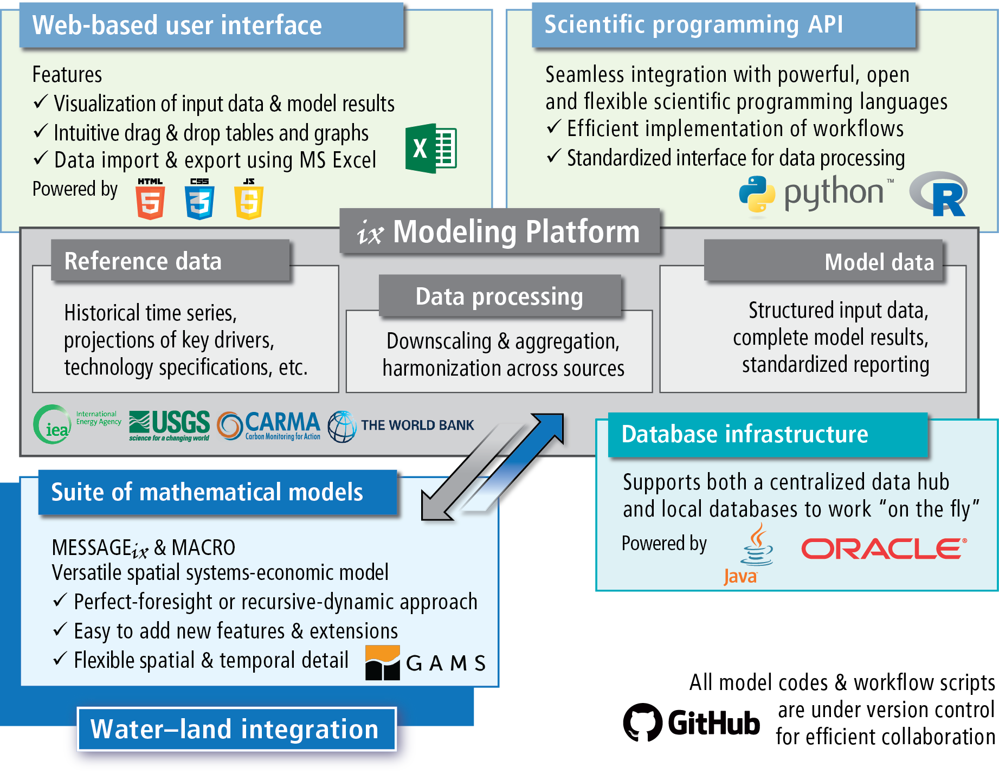

The |ixmp|
==========

.. figure:: _static/ix_features.png
   :width: 320px
   :align: right

   Key features of the |ixmp| (source: :cite:`huppmann_messageix_2018`)

The |ixmp| (ixmp) is a data warehouse for high-powered numerical scenario
analysis.
It is designed to provide an effective framework for integrated and
cross-cutting analysis (hence the abbreviation *ix*).

The platform allows an efficient workflow between original input data sources
and implementations of mathematical models, via application programming
interfaces (API) with the scientific programming languages Python and R.
The platform also includes an API with the mathematical programming
software `GAMS`_.

.. _`GAMS` : http://www.gams.com

For the scientific reference, see Huppmann et al. (2019)
:cite:`huppmann_messageix_2018`.

   Components and their interlinkages in the |ixmp| (source :cite:`huppmann_messageix_2018`):
   web-based user interface, scientific programming interface,
   modeling platform, database backend,
   implementation of the |MESSAGEix| mathematical model formulation

Platform documentation
----------------------

.. toctree::
   :maxdepth: 2

   install
   tutorials
   Scientific programming API reference <api>
   bibliography

License and user guidelines
---------------------------

The |ixmp| is licensed under an `APACHE 2.0 open-source license`_.

.. _`APACHE 2.0 open-source license`: http://www.apache.org/licenses/LICENSE-2.0
.. _`LICENSE`: https://github.com/iiasa/ixmp/blob/master/LICENSE

Please see the :doc:`notice` for using the platform in scientific research.
Contributions to the platform itself are also welcome.

The community mailing list for questions and discussions on new features is hosted using Google Groups.
Please join at `groups.google.com/d/forum/message_ix`_
and use <message_ix@googlegroups.com> to send an email to the |MESSAGEix| user community.

.. toctree::
   :maxdepth: 1

   notice
   contributing
   contributor_license

.. _`groups.google.com/d/forum/message_ix` : https://groups.google.com/d/forum/message_ix
